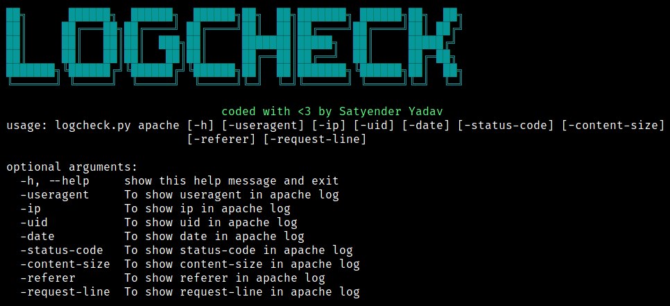
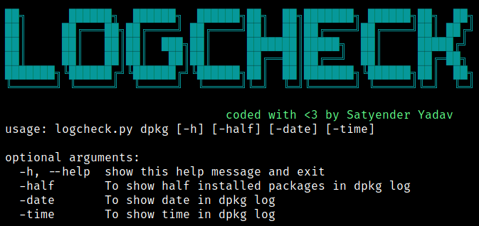
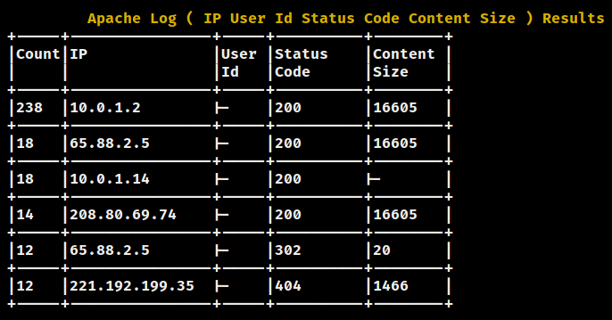
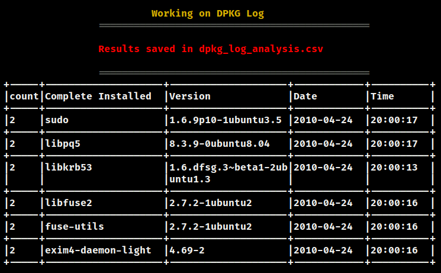

# LOGCHECK: Faster Way To Analyze Logs


## What is Logcheck ?

Logcheck is python based tool developed to analyze the log files easily with the feature of saving results to CSV files.

## Why Logcheck ?

There are a lot of tools already available in the market but most of them are paid and hard to set up, but logcheck is simple to use and it also shows results of log files having a size in MBs in a very short period of time.

## How to setup:
<b>Note: Only works on Python3.7+</b>

- git clone https://github.com/SatyenderYadav/logcheck.git
- Install dependencies: pip3 install -r requirements.txt
- python3 logcheck.py -h 


|Flag |                Description                                             |                       Example                            |
|-----|------------------------------------------------------------------------|----------------------------------------------------------|
| |                <center><b>Apache Access Log</b></center>                                             |                                       |
|  -useragent  | useragents in apache access log file             | python3 logcheck.py -f log_filename apache -useragent                      |
| -ip   | IPs in apache access log file | python3 logcheck.py -f log_filename apache -ip|
| -uid | User Ids in apache access log file| python3 logcheck.py -f log_filename apache -uid|
| -date | Date of requests done in apache access log file | python3 logcheck.py -f log_filename apache -date|
| -content-size | Content size in apache access log file | python3 logcheck.py -f log_filename apache -content-size|
| -status-code | Status Code of requests made in apache access log file | python3 logcheck.py -f log_filename apache -status-code|
| -referer | Url referers  | python3 logcheck.py -f log_filename apache -referer|
| |                <center><b>Multiple Commands in one line ( Apache Access Log )</b></center>  |              |
|  | IP, User Id, date, content-size  | python3 logcheck.py -f log_filename apache -ip -uid -content-size -date|
| |                                                          |                                       |
| |                <center><b>Dpkg Log</b></center>                                             |                                       |
| -half | Half Installed Pacakges  | python3 logcheck.py -f log_filename dpkg -half|
| -date | Date when packages are installed  | python3 logcheck.py -f log_filename dpkg -date|
| -time | Time when packages are installed  | python3 logcheck.py -f log_filename dpkg -time|
| |                <center><b>Multiple Commands in one line ( Dpkg Log )</b></center>                                             |     |
|  | half installed packages, date and time  | python3 logcheck.py -f log_filename dpkg -half -date -time|
| |                                                          |                                       |
| |                <center><b>OUTPUT</b></center>                                             |                                       |
| -o | Give name of the output csv file  | python3 logcheck.py -f log_filename -o results dpkg -half|
| -save | save the results to csv file  | python3 logcheck.py -f log_filename -save dpkg -half|

## Outputs:

```bash
python3 logcheck.py apache -h
```


```bash
python3 logcheck.py dpkg -h
```


```bash
python3 logcheck.py apache -ip -uid -status-code -content-size
```


```bash
python3 logcheck.py -save dpkg -date -time
```


## Credits:
TableStream : Used to create table for results [Philippe Lagadec](http://www.decalage.info)